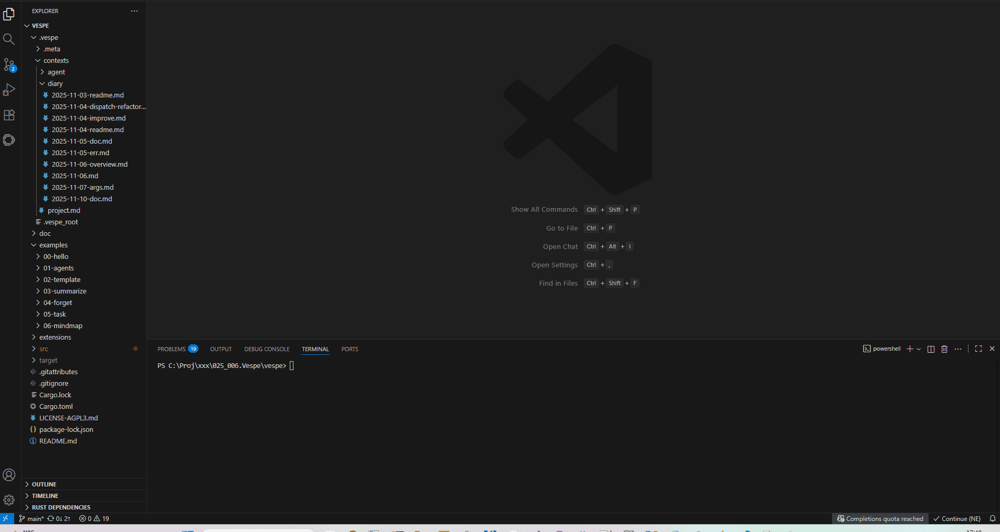

# vespe: Collaborative Textual Mind-Mapping with LLMs
[](https://www.gnu.org/licenses/agpl-3.0)
[](https://www.rust-lang.org)

`vespe` is a powerful command-line interface (CLI) tool designed to facilitate a seamless, collaborative mind-mapping experience between users and Large Language Models (LLMs). It enables you to co-create, refine, and expand your ideas by treating your documents as dynamic, interactive canvases.

## How it Works



At its core, `vespe` operates on a collection of textual documents, referred to as "contexts." These documents are managed within the `.vespe` folder, which acts as a sidecar to your main project. These are standard Markdown files augmented with special custom commands (tags) that allow for direct interaction with LLMs and dynamic content generation. This approach transforms static documents into living, evolving knowledge bases.

## Why vespe?

`vespe` addresses key challenges in leveraging LLMs effectively:

*   **Context is King**: LLM answers are only as good as the query context provided. `vespe` gives you precise control over what information the LLM receives.
*   **User-Centric Focus**: You, the user, are the expert on your project and its current focus. `vespe` empowers you to guide the LLM with your domain knowledge.
*   **Fine-Grained Control**: `vespe` offers granular control over the context provided to the LLM, allowing you to craft highly relevant and effective prompts.


## Philosophy

`vespe` is built on a few core principles:

*   **Text as a Canvas**: Your documents are not just static files; they are interactive canvases for collaboration with AI. `vespe` empowers you to weave AI-generated content directly into your notes, drafts, and mind maps.
*   **Seamless Integration**: The tool is designed to be unobtrusive. The tag-based syntax is simple and integrates naturally with Markdown, so you can focus on your ideas, not on the tooling.
*   **You are in Control**: `vespe` gives you fine-grained control over the interaction with LLMs. You can choose the provider, shape the prompts, and direct the output.
*   **Iterative and Dynamic**: The `watch` mode and the tag system encourage an iterative workflow. You can refine your prompts, re-run contexts, and evolve your documents in real-time.
*   **Local First**: `vespe` is a local tool that works with your local files. It can be used with local LLMs (like Ollama) for a completely offline experience.

## Table of Contents
- [How it Works](#how-it-works)
- [Philosophy](#philosophy)
- [Installation](#installation)
  - [Prerequisites](#prerequisites)
  - [Steps](#steps)
- [Getting Started: A Quick Glimpse](#getting-started-a-quick-glimpse)
- [Tag Syntax](#tag-syntax)
  - [Example](#example)
- [Core Tags](#core-tags)
  - [@answer](#answer)
  - [@include](#include)
  - [@set](#set)
  - [@forget](#forget)
  - [@comment](#comment)
  - [@repeat](#repeat)
  - [@answer Advanced](#answer-advanced)
  - [@inline](#inline)
  - [@task / @done](#task--done)
- [Templating with Handlebars](#templating-with-handlebars)
  - [Special Variables](#special-variables)
- [Examples](#examples)
- [CLI Usage](#cli-usage)
  - [`vespe init`](#vespe-init)
  - [`vespe context new`](#vespe-context-new)
  - [`vespe context run`](#vespe-context-run)
  - [`vespe watch`](#vespe-watch)
- [Piping Data into Contexts](#piping-data-into-contexts)
- [License](#license)
- [NO-WARRANTY](#no-warranty)
- [Contributing](#contributing)

## Installation

To use `vespe`, you'll need to have **Rust** and its package manager, **Cargo**, installed on your system.

### Prerequisites

*   **Rust & Cargo**: Required to build and install the `vespe` CLI. You can get them from the [official Rust website](https://www.rust-lang.org/tools/install).
*   **A Command-Line LLM**: `vespe` works by calling an external command to interact with a Large Language Model. You need to have at least one LLM accessible from your shell.

    Here are a few examples of how you can set this up:

    *   **Google Gemini**: You can use the `gemini` CLI. Make sure it's installed and configured in your system's PATH. You can get it from the [gemini-cli repository](https://github.com/google-gemini/gemini-cli). The `@answer` provider command would look like `{ provider: "gemini -y" }`.
    *   **Ollama**: If you run models locally with [Ollama](https://ollama.com/), you can use its CLI. The provider command might be `{ provider: "ollama run mistral" }`.

    Essentially, any command that can take a prompt from standard input and return a response to standard output will work as a `provider`.

### Steps

1.  **Clone the Repository**:
    First, clone the `vespe` repository to your local machine:

    ```shell
    git clone https://github.com/thepyper/vespe.git
    cd vespe
    ```

2.  **Install `vespe`**:
    Navigate into the cloned directory and use Cargo to install the `vespe` command-line tool. This will compile the project and place the `vespe` executable in your Cargo bin directory, making it available globally in your shell's PATH.

    ```shell
    cargo install --path .
    ```

    If you encounter any issues, ensure your Cargo bin directory is in your system's PATH. You can usually find instructions for this in the Rust installation guide.

After these steps, you should be able to run `vespe` from any directory in your terminal.

## Getting Started: A Quick Glimpse

Let's dive right in with a simple example.

1.  **Initialize your project:**

    Open your terminal, navigate to your project and run:

    ```shell
    vespe project init
    ```

    This creates a `.vespe` directory in your project, where all your contexts will be stored.

2.  **Create your first context:**

    A "context" is just a Markdown file where you can interact with the AI. Let's create one called `hello`:

    ```shell
    vespe context new hello
    ```

    This will create a file named `hello.md` inside the `.vespe/contexts` directory.

3.  **Add a prompt and an AI command:**

    Open `hello.md` in your favorite editor and add the following lines:

    ```markdown
    Tell me something nice!

    @answer { provider: "gemini -y -m gemini-2.5-flash" }
    ```

4.  **Run `vespe` to get a response:**

    Now, execute the context:

    ```shell
    vespe context run hello
    ```

    `vespe` will process the file, send the prompt to the Gemini model, and inject the answer directly into your `hello.md` file. It will look something like this:

    ```markdown
    Tell me something nice!

    <!-- answer-a98dc897-1e4b-4361-b530-5c602f358cef:begin { provider: "gemini -y -m gemini-2.5-flash" } -->
    You are an amazing person, and you're capable of achieving wonderful things!
    <!-- answer-a98dc897-1e4b-4361-b530-5c602f358cef:end -->
    ```

And that's it! You've just used `vespe` to collaborate with an LLM on a document.

## Tag Syntax

The power of `vespe` lies in its simple yet powerful tag syntax. Each tag follows a consistent structure that is easy to read and write.

The general syntax for a tag is:

```
@tag_name {key1: "value1", key2: value2} positional_argument
```

Let's break it down:

*   **`@tag_name`**: This is the command you want to execute (e.g., `@answer`, `@include`). It always starts with an `@` symbol.
*   **`{...}` (Parameters)**: This is a JSON-like object containing key-value pairs that configure the tag's behavior. `vespe` uses a more flexible version of JSON for convenience:
    *   Quotes around keys are optional (e.g., `provider` is the same as `"provider"`).
    *   Quotes around string values are optional if the value doesn't contain spaces or special characters.
*   **Positional Arguments**: Some tags can also take additional arguments after the parameter block. For example, `@include` takes a file path.

### Example

Consider the `@answer` tag from our "Getting Started" example:

```markdown
@answer { provider: "gemini -y -m gemini-2.5-flash" }
```

*   **Tag Name**: `@answer`
*   **Parameters**: `{ provider: "gemini -y -m gemini-2.5-flash" }`
    *   The key is `provider`.
    *   The value is `"gemini -y -m gemini-2.5-flash"`. In this case, quotes are necessary because the value contains spaces.

This flexible syntax makes writing `vespe` commands feel natural and unobtrusive within your Markdown files.

## Core Tags

`vespe` provides a set of powerful tags to control the interaction with LLMs and manage your content.

### @answer

The `@answer` tag is the primary way to interact with an LLM. It sends the content preceding it as a prompt and injects the model's response into the document.

**Usage:**
```markdown
What is the capital of France?

@answer { provider: "gemini -y" }
```

### @include

The `@include` tag statically inserts the content of another context file. This is useful for reusing prompts or structuring complex contexts.
File lookup happens in .vespe directory, and .md extension is added to given path.

**Usage:**
```markdown
@include my_common_prompts/preamble

Now, do something specific.

@answer { provider: "gemini -y" }
```

You can also pass data to the included file, which can be used for templating with [Handlebars](https://handlebarsjs.com/) syntax.

**`data-example.md`:**
```markdown
Hello, {{name}}!
```

**`main.md`:**
```markdown
@include data-example { data: { name: "World" } }
```
This will resolve to "Hello, World!".

### @set

The `@set` tag defines default parameters for all subsequent tags in the current context. This helps to avoid repetition.

**Usage:**
```markdown
@set { provider: "gemini -y -m gemini-2.5-pro" }

What is the meaning of life?
@answer
<!-- This will use the provider set above -->

Tell me a joke.
@answer
<!-- This will also use the same provider -->
```

### @forget

The `@forget` tag clears all the context that came before it. This is like starting a fresh conversation with the LLM within the same file.

**Usage:**
```markdown
--- First Conversation ---
Prompt for the first question.
@answer { provider: "gemini -y" }

@forget

--- Second Conversation ---
This prompt is sent without the context of the first one.
@answer { provider: "gemini -y" }
```

### @comment

The `@comment` tag is used to add comments within your context files. The content of this tag is completely ignored by the `vespe` engine and is not sent to the LLM.
Note that json+ syntax is anyway required, so you can use strings for example to annotate comments.

**Usage:**
```markdown
@comment {
  _1: "This is a note for myself.     ",
  _2: "The LLM will not see this.     ",
}
```

### @repeat

The `@repeat` tag forces the re-execution of the dynamic anchor it is placed within (like `@answer` or `@inline`). Context will be re-read so any correction to query can be made. `@repeat` can also modify the parameters of the anchor it is repeating: the repeated anchor will inherith parameters from the @repeat tag.

**Usage:**
```markdown
<!-- answer-some-uuid:begin { provider: "gemini -y" } -->
Initial answer from the model.

@repeat { provider: "ollama run qwen2.5:1.5b" }
<!-- answer-some-uuid:end -->
```
In the next run, the `@answer` block will be executed again, with different parameters and re-reading the surrounding context.


### @answer Advanced

This section details advanced parameters for the `@answer` tag, allowing for fine-tuned control over prompt construction and output management.

**Multiple Choices:**
Force the LLM to choose from a predefined set of options. `vespe` will insert the content associated with the chosen option.

```markdown
What is the best programming language for my project?

@answer {
  provider: "gemini -y",
  choose: {
    "Rust": "Rust is the best because of its safety and performance.",
    "Python": "Python is the best for its simplicity and vast libraries."
  }
}
```

**Dynamic Answers:**
You can make an answer dynamic, so it automatically updates if the input context changes.

```markdown
@answer { provider: "gemini -y", dynamic: true }
```

**Advanced Prompt Control:**

You can fine-tune the prompt sent to the LLM and manage the output using a set of advanced parameters.

**Agent Persona and Conversation Flow:**

-   `with_agent_names: true`: When dealing with a conversation history involving multiple agents, this option assigns a unique, consistent name to each agent (e.g., "Agent-A", "Agent-B"). This helps the LLM maintain a coherent persona for each participant. The system prompt will also be updated with "You are <agent_name>" to reinforce the current agent's identity.
-   `with_invitation: true`: Appends "Assistant:" (or "Assistant <agent_name>:" if `with_agent_names` is active) at the end of the prompt. This serves as a clear signal for the LLM to begin its response, guiding the turn-taking in the conversation.

**Input Redirection:**

-   `input: "path/to/context"`: Replaces the current prompt with the content of another context file. This is useful for running a standard prompt from a different file.
-   `input_data: { ... }`: Used with `input` to pass data to the specified context file, which is treated as a Handlebars template.

*Example:*

Let's say you have a file `my_prompts/question.md`:

```markdown
Tell me about {{topic}}.
```

You can use it in another file like this:

```markdown
@answer {
  provider: "gemini -y",
  input: my_prompts/question,
  input_data: { topic: "Rust" }
}
```

This will send "Tell me about Rust." to the LLM.

**Prompt Augmentation:**

-   `prefix: "path/to/context"`: Prepends the content of another file to the current prompt as a `system` message. This is ideal for setting a persona or providing instructions to the LLM.
-   `prefix_data: { ... }`: Used with `prefix` to pass data to the prefix file.
-   `postfix: "path/to/context"`: Appends the content of another file to the current prompt as a `system` message. Useful for adding constraints or formatting instructions.
-   `postfix_data: { ... }`: Used with `postfix` to pass data to the postfix file.

*Example:*

`my_prompts/persona.md`:
```markdown
You are a helpful assistant that speaks like a pirate.
```

`my_prompts/format.md`:
```markdown
Please answer in less than 20 words.
```

`main.md`:
```markdown
What is the capital of France?

@answer {
  provider: "gemini -y",
  prefix: my_prompts/persona,
  postfix: my_prompts/format
}
```

This will construct a prompt where the LLM is first instructed to act like a pirate, then given the question, and finally told to keep the answer short.

**Output Redirection:**

-   `output: "path/to/context"`: Redirects the LLM's response to a specified context instead of injecting it back into the current document. The content of the `@answer` tag will be cleared.

*Example:*

```markdown
Summarize the following text and save it to a file.

@answer {
  provider: "gemini -y",
  output: output/summary
}
```

The LLM's summary will be saved in `.vespe/output/summary.md`.

### @inline

The `@inline` tag dynamically includes content from another file. Unlike `@include`, this creates a dynamic anchor and file is inlined in current context. This can be re-executed by a `@repeat` tag. This is useful to instantiate templates.

**Usage:**
```markdown
@inline path/to/template
```

Like `@include`, it also supports passing `data` for templating.

### @task / @done

The `@task` and `@done` tags work together to manage sequential tasks, like following a plan or a list of steps. They allow you to execute a large task one step at a time, ensuring the LLM only focuses on the current action while preserving the history of what's already been completed.

**How it Works:**

1.  **`@task`**: Place this tag at the beginning of your sequential plan. It creates a dynamic anchor that will wrap the completed steps. The content before the `@task` tag acts as the main instruction or goal for the entire sequence.
2.  **`@done`**: Place this tag immediately after the `@answer` for the step you want to execute.

When `vespe` runs, the `@done` tag does two things:
*   It signals that the current step is complete.
*   It moves the completed step (including the prompt and the LLM's answer) *inside* the `@task` anchor.

The effect is that for the next run, the completed step is "hidden" from the LLM's context. The LLM will only see the main instruction and the *next* step in the sequence, preventing confusion and keeping the focus on the current action.

**Usage Example:**

Imagine a file where you are working through a checklist.

**Initial setup (before the first run):**
```markdown
I'm going to make coffee by following these steps. I will tell you when I'm done with a step.

@task

1. Open the moka pot.

2. Clean the moka pot.

3. Fill the base with water.
```

**After the first run, the file becomes:**
```markdown
I'm going to make coffee by following these steps. I will tell you when I'm done with a step.

<!-- task-some-uuid:begin -->
<!-- task-some-uuid:end -->

1. Open the moka pot.

2. Clean the moka pot.

3. Fill the base with water.
```

Now we're ready to answer the first step:

```markdown
I'm going to make coffee by following these steps. I will tell you when I'm done with a step.

<!-- task-some-uuid:begin -->
<!-- task-some-uuid:end -->

1. Open the moka pot.
@answer

2. Clean the moka pot.

3. Fill the base with water.
```

**After the second run, the file becomes:**
```markdown
I'm going to make coffee by following these steps. I will tell you when I'm done with a step.

<!-- task-some-uuid:begin -->
<!-- task-some-uuid:end -->

1. Open the moka pot.
<!-- answer-another-uuid:begin -->
Okay, the moka pot is open.
<!-- answer-another-uuid:end -->

2. Clean the moka pot.

3. Fill the base with water.
```

Now first step is done, then we can archive it in the task anchor by using `@done`:
```markdown
I'm going to make coffee by following these steps. I will tell you when I'm done with a step.

<!-- task-some-uuid:begin -->
<!-- task-some-uuid:end -->

1. Open the moka pot.
<!-- answer-another-uuid:begin -->
Okay, the moka pot is open.
<!-- answer-another-uuid:end -->
@done

2. Clean the moka pot.

3. Fill the base with water.
```

**After the third run, the file becomes:**
```markdown
I'm going to make coffee by following these steps. I will tell you when I'm done with a step.

<!-- task-some-uuid:begin -->

1. Open the moka pot.
<!-- answer-another-uuid:begin -->
Okay, the moka pot is open.
<!-- answer-another-uuid:end -->
<!-- task-some-uuid:end -->

2. Clean the moka pot.

3. Fill the base with water.
```

For the next execution, you would move the `@answer` and `@done` tags to be after step 2. The LLM would be prompted with the main instruction and "2. Clean the moka pot.", but it would not see the context from step 1.

## Templating with Handlebars

All contexts in `vespe` are processed as [Handlebars](https://handlebarsjs.com/) templates. This means you can use Handlebars syntax to create dynamic and reusable content within your Markdown files, and inject values with the `data`, `input_data`, `prefix_data`, `postfix_data` parameters.

### Special Variables

`vespe` provides several special variables that can be used within your Handlebars templates:

*   `{{$1}}`, `{{$2}}`, ... `{{$n}}`: Represents the first positional command-line argument passed to `vespe context run`. For example, if you run `vespe context run my-context arg1 arg2`, `{{$1}}` will be `arg1`.
*   `{{$args}}`: Represents all positional command-line arguments as a space-separated string. Using the previous example, `{{$args}}` would be `arg1 arg2`.
*   `{{$input}}`: Represents the input received from `stdin`. If you pipe content to `vespe context run`, this variable will hold that content.

## Examples

You can find many examples in the `examples/` directory.

## CLI Usage

`vespe` provides a simple yet powerful command-line interface to manage your projects and contexts.

### `vespe init`

Initializes a new `vespe` project in the current directory or a specified path. This command creates the `.vespe` directory where all your contexts and configurations are stored. Git integration is enabled to project if the specified path is in a git repository.

**Usage:**

```shell
vespe init [--project-root <PATH>]
```

*   `--project-root <PATH>`: (Optional) The path to the directory where the project should be initialized. Defaults to the current directory.

### `vespe context new`

Creates a new context file within your project.

**Usage:**

```shell
vespe context new [NAME] [--today] [--context-template <FILE>]
```

*   `[NAME]`: The name for the new context (e.g., `my-feature/story`). This will create a corresponding Markdown file.
*   `--today`: A convenient flag to create a diary-style context for the current date (e.g., `diary/2025-11-10.md`).
*   `--context-template <FILE>`: (Optional) Path to a custom Handlebars template file to use for the new context.

### `vespe context run`

Executes a context file. `vespe` processes the tags within the file and outputs the context when all tags have been executed.

**Usage:**

```shell
# Execute a context by name
vespe context run [NAME] [--today] [-D <KEY>=<VALUE>]... [-I <PATH>]... [-O <PATH>] [ARGS]...

# Pipe content into a context
cat my-data.txt | vespe context run [NAME]
```

*   `[NAME]`: The name of the context to execute.
*   `--today`: A flag to execute the context for the current date.
*   `-D <KEY>=<VALUE>`: (Optional) Defines a variable that can be used within the context via Handlebars syntax (e.g., `{{$KEY}}`). This is useful for passing dynamic values to your templates. For example, running with `-D name=World` allows you to use `{{$name}}` in your context. This option can be specified multiple times.
*   `-I <PATH>`: (Optional) Adds an auxiliary directory path to search for input files (e.g., for `@include`, `@inline` or `@answer input/prefix/postfix:` ). When resolving a file, `vespe` will first check the project's root path and then search the specified auxiliary paths in order. This allows you to organize and reuse context files from shared locations. This option can be specified multiple times.
*   `-O <PATH>`, `--output-path <PATH>`: (Optional) Specifies a directory where output files should be written. When an `@answer` tag uses the `output:` parameter, the resulting file will be created in this directory instead of the default `.vespe/contexts` location. This is useful for directing generated content to a specific folder, such as `dist` or `build`.
*   `[ARGS]...`: (Optional) A list of string arguments that can be accessed within the context file using Handlebars syntax (e.g., `{{$1}}` for first argument, `{{$2}}` for second argument, and so on; {{$args}} for all of the arguments space-separated).
*   **Piped Input**: The `run` command can also receive text from `stdin`. This input is available within the context via the `{{$input}}` Handlebars variable.

### `vespe watch`

Starts a watcher that monitors your context files for any changes. When a file is modified, `vespe` automatically re-executes it, providing a live-editing experience.

**Usage:**

```shell
vespe watch [--project-root <PATH>]
```

This is very useful for iterative development, allowing you to see the results of your changes in real-time.

## Piping Data into Contexts

You can pipe data directly into a context:
```shell
cat logs/error.log | vespe context run analyze-errors
```

**analyze-errors.md:**
```markdown
Analyze these error logs and suggest fixes:

{{$input}}

@answer { provider: "gemini -y" }
```

This is powerful for processing command output, log files, or any text data.

## License

This project is licensed under the AGPL-3.0 license. See the [LICENSE-AGPL3.md](LICENSE-AGPL3.md) file for details.

## NO-WARRANTY

THE SOFTWARE IS PROVIDED "AS IS", WITHOUT WARRANTY OF ANY KIND, EXPRESS OR IMPLIED, INCLUDING BUT NOT LIMITED TO THE WARRANTIES OF MERCHANTABILITY, FITNESS FOR A PARTICULAR PURPOSE AND NONINFRINGEMENT. IN NO EVENT SHALL THE AUTHORS OR COPYRIGHT HOLDERS BE LIABLE FOR ANY CLAIM, DAMAGES OR OTHER LIABILITY, WHETHER IN AN ACTION OF CONTRACT, TORT OR OTHERWISE, ARISING FROM, OUT OF OR IN CONNECTION WITH THE SOFTWARE OR THE USE OR OTHER DEALINGS IN THE SOFTWARE.

Please be aware that this software interacts with Large Language Models (LLMs) in an unsupervised manner ("yolo mode"). The output generated by LLMs can be unpredictable, inaccurate, or even harmful. By using this software, you acknowledge and accept full responsibility for any consequences arising from its use, including but not limited to the content generated by LLMs and any actions taken based on that content. Exercise caution and critical judgment when interpreting and utilizing the output.

## Contributing

Contributions are welcome! If you want to contribute to `vespe`, please feel free to open an issue or submit a pull request.
